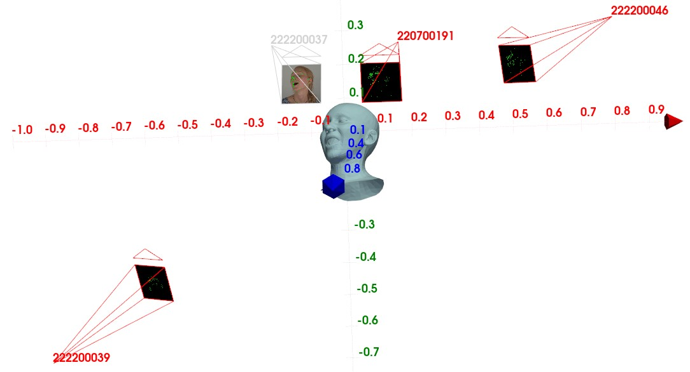

# NeRSemble Photorealistic 3D Head Avatar Benchmark

This is the official NeRSemble Benchmark Toolkit for downloading the data and preparing submissions for the NeRSemble Photorealistic 3D Head Avatar benchmarks.  
For submitting your results, please go to our [submission system](https://kaldir.vc.in.tum.de/nersemble_benchmark/).


## 1. Data Access & Setup

 1. Request access to the NeRSemble dataset (only necessary if you did not request access previously): https://forms.gle/rYRoGNh2ed51TDWX9
 2. Once approved, you will receive a mail with the download link in the form of
    ```python
    NERSEMBLE_BENCHMARK_URL = "..."
    ```
 3. Create a file at `~/.config/nersemble_benchmark/.env` with following content:
    ```python
    NERSEMBLE_BENCHMARK_URL = "<<<URL YOU GOT WHEN REQUESTING ACCESS TO NERSEMBLE>>>"
    ```
 4. Install this repository via
    ```pip install nersemble_benchmark```

## 2. Data Download

After installation of the benchmark repository, a `nersemble-benchmark-download` command will be available in your environment.
This is the main tool to download the benchmark data. To get a detailed description of download options, run `nersemble-benchmark-download --help`.
In the following, `${benchmark_folder}` denotes the path to your local folder where the benchmark data should be downloaded to.

### Overview

#### NVS Benchmark (1604 x 1100)

| Participant ID | Sequence       | #Frames  | Size        | Size (incl. pointclouds) |
|----------------|----------------|----------|-------------|--------------------------|
| 388            | GLASSES        | 1118     | 1.06 GB     | 21.8 GB                  |
| 422            | EXP-2-eyes     | 517      | 386 MB      | 16.1 GB                  |
| 443            | FREE           | 1108     | 1.19 GB     | 17.3 GB                  |
| 445            | EXP-6-tongue-1 | 514      | 401 MB      | 13.4 GB                  |
| 475            | HAIR           | 259      | 325 MB      | 773 MB                   |
|                |                | Σ = 3516 | Σ = 3.34 GB | Σ = 69.6 GB              |

13 out of the available 16 cameras are provided for training, the remaining 3 cameras (`222200046`, `222200037`, `222200039`) are hold-out and used to compute the test metrics.

#### Mono FLAME Avatar Benchmark (512 x 512)
| Participant ID | #Sequences (train / test) | #Frames (train / test) | Size       | 
|----------------|---------------------------|------------------------|------------|
| 393            | 18 / 4                    | 2,964 / 816            | 27 MB      | 
| 404            | 18 / 4                    | 2,009 / 665            | 28 MB      | 
| 461            | 18 / 4                    | 2,057 / 486            | 29 MB      | 
| 477            | 18 / 4                    | 2,543 / 530            | 37 MB      | 
| 486            | 18 / 4                    | 2,440 / 608            | 23 MB      |
|                |                           | 12,013 / 3,105         | Σ = 144 MB |

Only a single camera is provided for training: `222200037`.
For all participants, the same 4 sequences are held out: `EMO-1-shout+laugh`, `FREE`, `SEN-09-frown_events_bad`, and `SEN-10-port_strong_smokey`.
To compute test metrics, both the training camera as well as 3 hold-out cameras (`222200046`, `220700191`, `222200039`) are used to compute the test metrics.


### NVS Benchmark download

```shell
nersemble-benchmark-download ${benchmark_folder} nvs 
```

#### NVS pointclouds
The NVS benchmark also comes with pointclouds for each timestep that can be used to solve the task. 
Due to their size, per default only the first pointcloud of each sequence is downloaded which can be helpful to initialize 3D Gaussians for example.
To download the pointclouds for all frames of the benchmark sequences, use `--pointcloud_frames all`. The pointclouds contain 3D point positions, colors, and normals.

### Mono FLAME Avatar Benchmark download

```bash
nersemble-benchmark-download ${benchmark_folder} mono_flame_avatar 
```

#### FLAME tracking

The Mono FLAME Avatar benchmark comes with FLAME tracking for each timesteps of both the train sequences as well as the hold-out sequences.  
These are downloaded per default, but can also be specifically targeted for download via `--assets flame2023_tracking`.

## 3. Usage

### Data Managers

The benchmark repository provides data managers to simplify loading individual assets such as images in Python code.

```python
from nersemble_benchmark.data.benchmark_data import NVSDataManager
from nersemble_benchmark.constants import BENCHMARK_NVS_IDS_AND_SEQUENCES, BENCHMARK_NVS_TRAIN_SERIALS

benchmark_folder = "path/to/local/benchmark/folder"
participant_id, sequence_name = BENCHMARK_NVS_IDS_AND_SEQUENCES[0]  # <- Use first benchmark subject
serial = BENCHMARK_NVS_TRAIN_SERIALS[0]  # <- Use first train camera
timestep = 0  # <- Use first timestep

data_manager = NVSDataManager(benchmark_folder, participant_id)
```

#### Load image

```python
image = data_manager.load_image(sequence_name, serial, timestep)  # <- Load first frame. Background is already removed
```


#### Load Alpha Map

```python
image = data_manager.load_alpha_map(sequence_name, serial, timestep)  # <- Load alpha map
```


#### Load cameras

```python
camera_params = data_manager.load_camera_calibration()
world_2_cam_pose = camera_params.world_2_cam[serial]  # <- 4x4 world2cam extrinsic matrix in OpenCV camera coordinate convention
intrinsics = camera_params.intrinsics[serial]  # <- 3x3 intrinsic matrix
```

Furthermore, the [visualize_cameras.py](scripts/visualize/visualize_cameras.py) script shows the arrangement of the cameras in 3D. The hold-out cameras used for
the hidden test set are shown in red. The `388` indicates the ID of the participant (see the data section for available participant IDs in the benchmark)

```shell
python scripts/visualize/visualize_cameras.py ${benchmark_folder} 388
```


### NVS Data Manager assets
The dynamic NVS benchmark has some assets specific to the benchmark. The following code assumes the use of a `NVSDataManager`:
```python
from nersemble_benchmark.data.benchmark_data import NVSDataManager
nvs_data_manager = NVSDataManager(benchmark_folder, participant_id)
```

#### Load Pointcloud

```python
points, colors, normals = nvs_data_manager.load_pointcloud(sequence_name, timestep)  # <- Load pointcloud of some timestep
```


### Mono FLAME Avatar assets
The Mono FLAME Avatar benchmark has some additional assets specific to the benchmark. The following code assumes the use of a `MonoFlameAvatarDataManager`:
```python
from nersemble_benchmark.data.benchmark_data import MonoFlameAvatarDataManager
mono_flame_data_manager = MonoFlameAvatarDataManager(benchmark_folder, participant_id)
```

#### FLAME tracking

The FLAME tracking for the benchmark has been conducted with the FLAME 2023 model.  
The tracking result can be loaded via: 

```python
flame_tracking = mono_flame_data_manager.load_flame_tracking(sequence_name)  # <- Load the FLAME tracking for an entire sequence  
```

it contains shape and expression codes, jaw and eyes parameters, as well as rigid head rotation and translation in world space:
```python
class FlameTracking:
    shape               # (1, 300)
    expression          # (T, 100)
    rotation            # (T, 3)
    rotation_matrices   # (T, 3, 3)
    translation         # (T, 3)
    jaw                 # (T, 3)
    frames              # (T,)
    scale               # (1, 1)
    neck                # (T, 3)
    eyes                # (T, 6)
```

The FLAME tracking will provide a FLAME mesh that is already perfectly aligned with the given cameras from the benchmark.  
The easiest way to obtain the mesh from the tracking parameters is using the `FlameProvider` class:
```python
from nersemble_benchmark.models.flame import FlameProvider

flame_provider = FlameProvider(flame_tracking)
mesh = flame_provider.get_mesh(timestep)  # <- Get tracked mesh for the specified timestep in the sequence
```
The [visualize_flame_tracking.py](scripts/visualize/visualize_flame_tracking.py) script shows how to load the FLAME tracking and visualizes the corresponding FLAME mesh with the correct cameras:
```shell
python scripts/visualize/visualize_flame_tracking.py ${benchmark_folder} --participant_id 461
```


## 4. Submission

Submissions to the benchmark tasks are done by uploading a submission `.zip` file to our [submission system](https://kaldir.vc.in.tum.de/nersemble_benchmark/).
The following describes the expected format of a submission `.zip` file.

### 4.1. NVS Benchmark

#### Submission .zip creation

For each of the 5 benchmark sequences, you need to render the whole sequence from the three hold-out cameras (`222200046`, `222200037`, `222200039`).  
The corresponding camera extrinsics and intrinsics can be loaded the same way as the train cameras:
```python
from nersemble_benchmark.constants import BENCHMARK_NVS_HOLD_OUT_SERIALS

camera_params = data_manager.load_camera_calibration()
for serial in BENCHMARK_NVS_HOLD_OUT_SERIALS:
    world_2_cam_pose = camera_params.world_2_cam[serial]
    intrinsics = camera_params.intrinsics[serial]
    ...  #  <- Render video from your reconstructed 4D representation
```

Once you rendered the images from the hold out viewpoints for all frames of the 5 benchmark sequences, you can pack them into a `.zip` file for submission.  
The expected structure of the `.zip` file is as follows:
```yaml
nvs_submission.zip
├── 388
│   └── GLASSES
│       ├── cam_222200037.mp4  # <- Video predictions from your method
│       ├── cam_222200039.mp4
│       └── cam_222200046.mp4
├── 422
│   └── EXP-2-eyes
│       ├── cam_222200037.mp4
│       ├── cam_222200039.mp4
│       └── cam_222200046.mp4
┆
└── 475
    └── ...
```
Since `.mp4` is a lossy compression format, we use a very high quality setting of `--crf 14` to ensure the metric calculation is not affected by compression artifacts. 

To facilitate the creation of the submission .zip, this repository also contains some Python helpers that you can use:
```python
from nersemble_benchmark.data.submission_data import NVSSubmissionDataWriter

zip_path = ...  #  <- Local path where you want to create your submission .zip file
images = ...  # <-  List of uint8 numpy arrays (H, W, 3) in range 0-255 that hold the image data for all frames of a single camera

with NVSSubmissionDataWriter(zip_path) as submission_data_manager:
    submission_data_manager.add_video(participant, sequence_name, serial, images)  #  <- will automatically package the images into a .mp4 file and place it correctly into the .zip
```
Note that the `NVSSubmissionDataWriter` will overwrite any previously existing `.zip` file with the same path. So, the predictions for all sequences and all hold out cameras have to be added at once.

### 4.2. Monocular FLAME Avatar Benchmark

#### Submission .zip creation

For each of the 4 hold-out sequences of the 5 benchmark people, you need to render the whole sequence from the three hold-out cameras (`222200046`, `220700191`, `222200039`) as well as the train camera (`222200037`).  
The corresponding camera extrinsics and intrinsics can be loaded the same way as the train cameras:
```python
from nersemble_benchmark.constants import BENCHMARK_MONO_FLAME_AVATAR_IDS, BENCHMARK_MONO_FLAME_AVATAR_TRAIN_SERIAL, BENCHMARK_MONO_FLAME_AVATAR_HOLD_OUT_SERIALS, BENCHMARK_MONO_FLAME_AVATAR_SEQUENCES_TEST

camera_params = data_manager.load_camera_calibration()
for participant_id in BENCHMARK_MONO_FLAME_AVATAR_IDS:
    for sequence_name in BENCHMARK_MONO_FLAME_AVATAR_SEQUENCES_TEST:
        flame_tracking = data_manager.load_flame_tracking(sequence_name)
        flame_provider = FlameProvider(flame_tracking)  # <- Use FLAME tracking to get expression codes / tracked meshes for hold-out sequence
        # 3 hold-out cameras
        for serial in BENCHMARK_MONO_FLAME_AVATAR_HOLD_OUT_SERIALS:
            world_2_cam_pose = camera_params.world_2_cam[serial]
            intrinsics = camera_params.intrinsics[serial]
            ...  #  <- Render video from your reconstructed 3D head avatar representation

        # train viewpoint
        serial = BENCHMARK_MONO_FLAME_AVATAR_TRAIN_SERIAL
        world_2_cam_pose = camera_params.world_2_cam[serial]
        intrinsics = camera_params.intrinsics[serial]
        ...  #  <- Render video from your reconstructed 3D head avatar representation
```

Once you rendered all frames from the 4 viewpoints for all 4 hold-out sequences of the 5 benchmark persons, you can pack them into a `.zip` file for submission.  
The expected structure of the `.zip` file is as follows:
```yaml
mono_flame_avatar_submission.zip
├── 393
│   ├── EMO-1-shout+laugh
│   │   ├── cam_220700191.mp4  # <- Video predictions from your method
│   │   ├── cam_222200037.mp4
│   │   ├── cam_222200039.mp4
│   │   └── cam_222200046.mp4
│   ┆
│   └── SEN-10-port_strong_smokey
│       ├── cam_220700191.mp4
│       ├── cam_222200037.mp4
│       ├── cam_222200039.mp4
│       └── cam_222200046.mp4
┆
└── 486
    └── ...
```
Since `.mp4` is a lossy compression format, we use a very high quality setting of `--crf 14` to ensure the metric calculation is not affected by compression artifacts.

To facilitate the creation of the submission .zip, this repository also contains some Python helpers that you can use:
```python
from nersemble_benchmark.data.submission_data import MonoFlameAvatarSubmissionDataWriter

zip_path = ...  #  <- Local path where you want to create your submission .zip file
images = ...  # <-  List of uint8 numpy arrays (H, W, 3) in range 0-255 that hold the image data for all frames of a single camera

with MonoFlameAvatarSubmissionDataWriter(zip_path) as submission_data_manager:
    submission_data_manager.add_video(participant, sequence_name, serial, images)  #  <- will automatically package the images into a .mp4 file and place it correctly into the .zip
```
Note that the `MonoFlameAvatarSubmissionDataWriter` will overwrite any previously existing `.zip` file with the same path. So, the predictions for all sequences and all hold out cameras have to be added at once.
