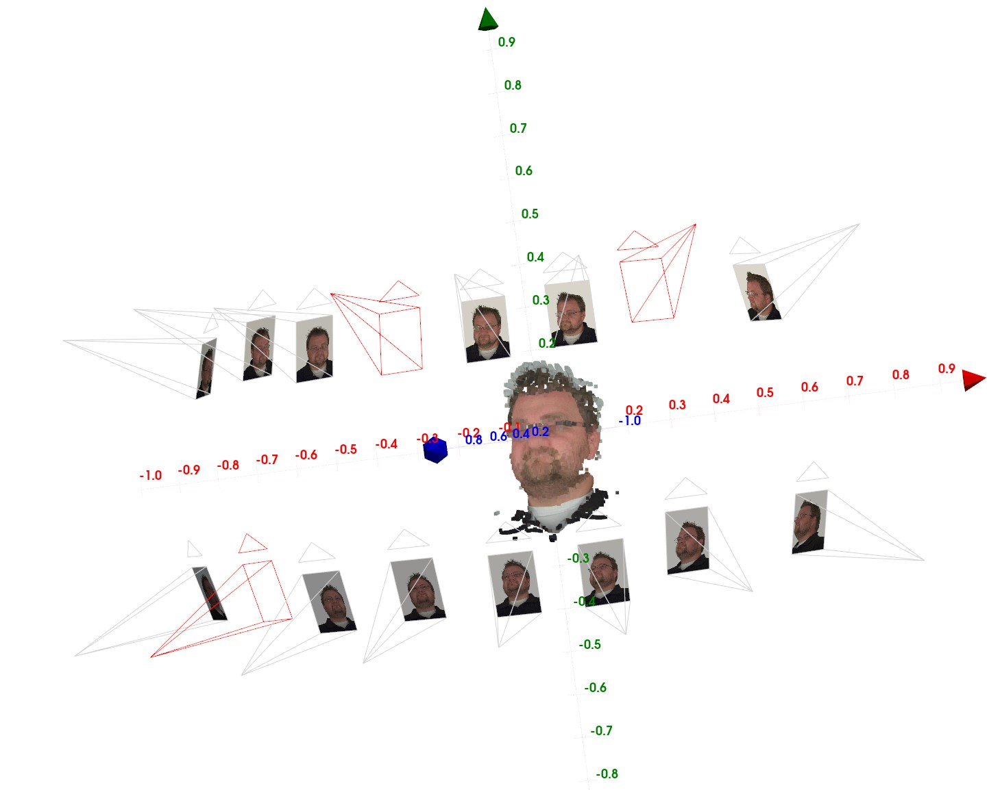

# NeRSemble Photorealistic 3D Head Avatar Benchmark

This is the official repository containing the devkit for downloading the data and submitting results to the NeRSemble Photorealistic 3D Head Avatar benchmarks.

## 1. Setup

### Repository installation

```shell
pip install nersemble_benchmark@git+ssh://git@github.com/tobias-kirschstein/nersemble-benchmark.git
```

### Environment variables

Create a file at `~/.config/nersemble_benchmark/.env` with following content:

```python
NERSEMBLE_BENCHMARK_URL = "<<<URL YOU GOT WHEN REQUESTING ACCESS TO NERSEMBLE>>>"
```

## 2. Data Download

After installation of the benchmark repository, a `nersemble-benchmark-download` command will be available in your environment.
This is the main tool to download the benchmark data. To get a detailed description of download options, run `nersemble-benchmark-download --help`.
In the following, `${benchmark_folder}` denotes the path to your local folder where the benchmark data should be downloaded to.

### Overview

#### NVS Benchmark

| Participant ID | Sequence       | #Frames  | Size        | Size (incl. pointclouds) |
|----------------|----------------|----------|-------------|--------------------------|
| 388            | GLASSES        | 1118     | 1.06 GB     | 21.8 GB                  |
| 422            | EXP-2-eyes     | 517      | 386 MB      | 16.1 GB                  |
| 443            | FREE           | 1108     | 1.19 GB     | 17.3 GB                  |
| 445            | EXP-6-tongue-1 | 514      | 401 MB      | 13.4 GB                  |
| 475            | HAIR           | 259      | 325 MB      | 773 MB                   |
|                |                | Σ = 3516 | Σ = 3.34 GB | Σ = 69.6 GB              |

### NVS Benchmark download

```shell
nersemble-benchmark-download ${benchmark_folder} nvs 
```

#### NVS pointclouds
The NVS benchmark also comes with pointclouds for each timestep that can be used to solve the task. 
Due to their size, per default only the first pointcloud of each sequence is downloaded which can be helpful to initialize 3D Gaussians for example.
To download the pointclouds for all frames of the benchmark sequences, use `--pointcloud_frames all`. The pointclouds contain 3D point positions, colors, and normals.

## 3. Usage

### Data Managers

The benchmark repository provides data managers to simplify loading individual assets such as images in Python code.

```python
from nersemble_benchmark.data.benchmark_data import NVSDataManager
from nersemble_benchmark.constants import BENCHMARK_NVS_IDS_AND_SEQUENCES, BENCHMARK_NVS_TRAIN_SERIALS

benchmark_folder = "path/to/local/benchmark/folder"
participant_id, sequence_name = BENCHMARK_NVS_IDS_AND_SEQUENCES[0]  # <- Use first benchmark subject
serial = BENCHMARK_NVS_TRAIN_SERIALS[0]  # <- Use first train camera
timestep = 0  # <- Use first timestep

data_manager = NVSDataManager(benchmark_folder, participant_id)
```

#### Load image

```python
image = data_manager.load_image(sequence_name, serial, timestep, apply_alpha_map=True)  # <- Load first frame and remove background
```


#### Load Alpha Map

```python
image = data_manager.load_alpha_map(sequence_name, serial, timestep)  # <- Load alpha map
```


#### Load Pointcloud

```python
points, colors, normals = data_manager.load_pointcloud(sequence_name, timestep)  # <- Load pointcloud of first timestep
```


#### Load cameras

```python
camera_params = data_manager.load_camera_calibration()
world_2_cam_pose = camera_params.world_2_cam[serial]  # <- 4x4 world2cam extrinsic matrix in OpenCV camera coordinate convention
intrinsics = camera_params.intrinsics  # <- 3x3 intrinsic matrix
```

Furthermore, the [visualize_cameras.py](scripts/visualize/visualize_cameras.py) script shows the arrangement of the cameras in 3D. The hold-out cameras used for
the hidden test set are shown in red. The `388` indicates the ID of the participant (see the data section for available participant IDs in the benchmark)

```shell
python scripts/visualize/visualize_cameras.py ${benchmark_folder} 388
```

